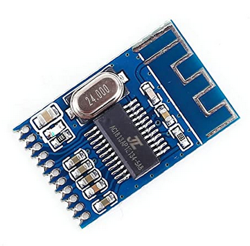
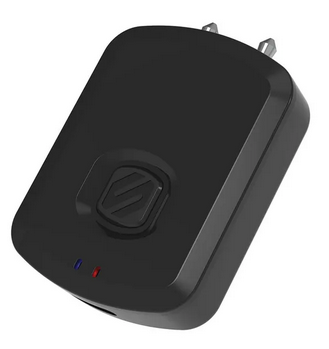
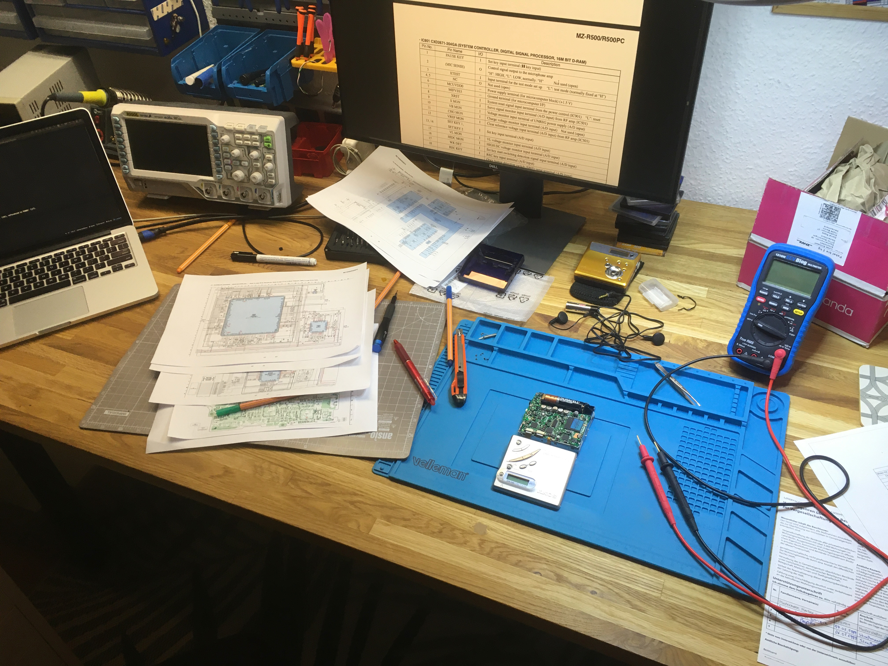
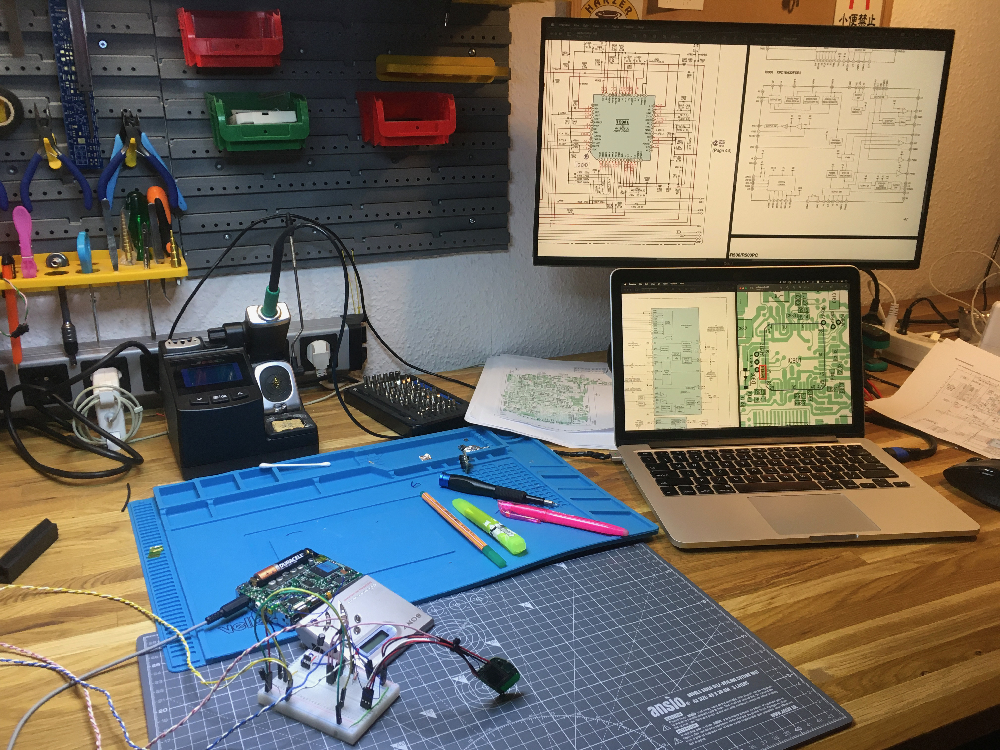
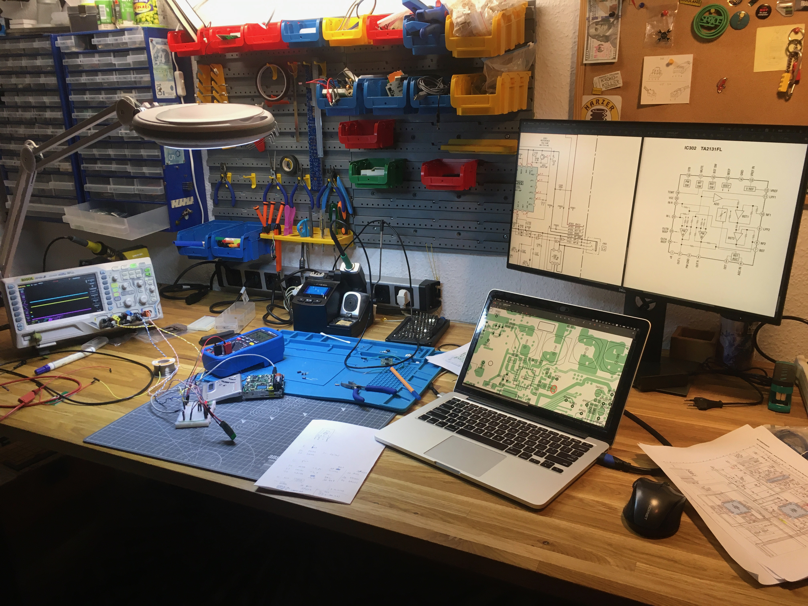

[Home](readme.md) |
Reverse engineering |
[BTMD v0.1](v0.1.md) -
[v0.2](v0.2.md) -
[v0.3](v0.3.md) -
[v0.4](v0.4.md) |
[References](refs.md)

## Reverse engineering

### Bluetooth modules

#### Receivers used for testing

- Anker SoundCore 2 speaker
- Apple AirPods Pro, 1st generation

#### "KCX_BT_Transmitter"



- There doesn't seem to be a more official name for this module
- It is widely available on [AliExpress](https://www.aliexpress.com/item/33058710334.html), [TaoBao](https://item.taobao.com/item.htm?spm=a21wu.12321156-tw.0.0.7e76d1c7xEOcFZ&id=570274835710), [Amazon (DE)](https://www.amazon.de/Sendermodul-Bluetooth-Transceiver-Lautsprecher-KCX_BT_EMITTER/dp/B07YKYPJ22/) and others.
- There is a [GitHub repo](https://github.com/Mark-MDO47/BluetoothAudioTransmitter_KCX_BT_EMITTER) with utilities for this chip
- There is an [Electro-Tech-Online forum thread](https://www.electro-tech-online.com/threads/kcx_bt_emitter-low-cost-bluetooth-bt-audio-module.158156/)

##### Playing around with AT Commands

9600 bps, 8N1, no EOL char

```
AT+ // Just to make sure transmission is good
AT+REST // Reset - and this will start scanning
AT+DISCON // even though you are not connected
AT+DELVMLINK // erase saved memory of prior connection
AT+VMLINK? // view VM Links in saved memory (should be none)

AT+SCAN

AT+CONADD=0x08ebed1d110c // Anker SoundCore 2
AT+CONADD=0x0c3b50a0e8aa // Apple AirPods Pro
```
##### Attempts to set the volume
- `AT+CLVL=50`? (https://m2msupport.net/m2msupport/audio-at-commands-to-configure-device-audio-features/)
- `AT+LVL=N` (https://m2msupport.net/m2msupport/atlvl-loudspeaker-volume-level/)
- `L0 ~ L3` (https://en.wikipedia.org/wiki/Hayes_command_set)
- `AT+CMUT` (mute? https://www.youtube.com/watch?v=q5bVo-mh2Ig)
- `AT+CRSL`

:no_entry_sign: Testing was abandoned when no successful connections could be established.

#### Scosche Flytunes



[Manufacturer website](https://www.scosche.com/wireless-bluetooth-audio-transmitter)

##### Initial tests

- Anker SoundCore 2:
  - Successful connection on first attempt! :tada:
- AirPods Pro
  - Finding the correct timing to press the pairing buttons on both devices was tricky
  - Successful connection after a few attempts
  - Auto-reconnect after power cycling :tada:

##### Misc. notes

- Seems to work OK with 3.3V on battery terminal
- Unidentified voltage regulator (?) IC `U4`, labeled either `S2R`, `S2R1` or `S2RI`....
- Button seems to be pulled up to BAT+ (TBC), via 10k resistor `R6`, into GPIO on third pin of short side of blue module, counting from the corner where Audio In L/R is.
- LEDs go from BAT+ via 1k resistors to pins 5 and 6 on the long side of blue module near the 8 test pads
- Does not auto-turn on upon applying power to battery terminals -> good or bad? -> optional RC circuit to virtually hold button for 3 < x < 5 sec. on startup -> comparator circuit
- Max current draw (as displayed by benchtop power supply)
 - 20 ~ 30 mA @ 3.3V connected and transmitting
 - less than 1 mA when searching
- USB C connector desoldered with hot air gun @350 °C
- Push button and LEDs need to be desoldered for flush mounting using 1x Kapton tape + 2x double-sided adhesive tape
- TL-BC5-16 Bluetooth module
  - https://wenku.baidu.com/view/ff4f81d99fc3d5bbfd0a79563c1ec5da50e2d638.html?re=view
  - https://wenku.baidu.com/view/0b3e195f33d4b14e84246841.html
  - Macronix MX29LV160D
    Flash Memory
    https://www.macronix.com/Lists/Datasheet/Attachments/7263/MX29LV160D%20T-B,%203V,%2016Mb,%20v1.2.pdf
  - CSR57E6
    Bluetooth Stereo Audio Transmitter Module
    http://ecksteinimg.de/Datasheet/CP12009/BTA-TX-A%20CSR57E6.pdf


:white_check_mark: Selected for use in BTMD prototype

#### Other candidates (not tested)

##### TaoTronics TT-BA07

- [Manufacturer website](https://de.taotronics.com/TT-BA07-Bluetooth-Adapter.html)
- Supposedly works with Apple AirPods --> to be tested
- Bluetooth version...
  5.0? 4.1?

##### iLuv AirFree

- [Manufacturer website](https://www.iluv.com/products/airfree)
- AirPods compatible (claimed by manufacturer)

##### Hagibis X3

- [Qualcomm aptX website](https://www.aptx.com/products/hagibis-x3)
- [Discovered via Reddit](https://www.reddit.com/r/minidisc/comments/lzlp6a/mzrh1_crystal_method_bluetooth_transciever/)

##### Aluratek AirStream

- [Manufacturer website](https://aluratek.com/airstream-universal-bluetooth-audio-transmitter)
- [Discovered via Reddit](https://www.reddit.com/r/minidisc/comments/je8dyx/simply_awesome_listening_to_my_mds_wirelessly_in/)

##### 1Mii ML400

- [Manufacturer website](https://www.1mii.com/product-item/ml400-bluetooth-receiver/)
- Bluetooth 5.0
- claimed AirPods compatible
- nice small form factor, no battery, only USB-C power

### Minidisc internals

See [references page](refs.md) for schematics and other useful documents.

Sony MZ-R500 ([minidisc.org](https://www.minidisc.org/part_Sony_MZ-R500.html), [MiniDisc wiki](https://www.minidisc.wiki/equipment/sony/portable/mz-r500)) was chosen for its wide availability and reasonable second-hand price.

#### Potential power rails for Bluetooth

##### GND

Potential access points:
- Main chassis ground?
- AP609
- S801 (Hold switch)
- TP910

##### "VG"

- Listed as 7.3V in schematic diagram.
- Measured as 6.6V @ AP914 against hold switch GND
- Measured as 7.0V @ C608

Potential access points:
- IC601 - `VG` (pin 36)
- IC701 - `VG` (pin 23)
- IC901 - `VG` (pin 19)
- C608 +
- C920
- D903 - (to `LG`)
- AP914

Other thoughts:
- IC901 Block diagram: IC901 "generates" `VG` (19) from `LG` (18), referenced to`PGND2` (17).
- `PGND2` as ideal GND point? TP910 is relatively close to IC901 where `VG` is generated...
- Overall block diagram: IC901 `VG` is output, `LG` is direct battery voltage "VB" for headphone amp (IC302), Motor/Coil drive (IC701), System controller (IC801) via L904.
- D903 (MA729-TX Schottky) links `LG` (anode) to `VG` (cathode).

##### "LG"

Comes directly from battery +

- IC901 pin 18
- IC701
  - `VM1` (pin 7)
  - `VMU` (pin 49)
  - `VWVW` (pin 45)
  - All three seem to be high sides of H-bridge drivers:
    - `VM1` for `RO1`, `FO1`, `RO2`, `FO2` etc. (focus and tracking coil drive)
    - `VMU` and `VWVW` for `U0`, `V0`, `W0` (`M601`, spindle)

Potential acces points:
- AP951
- AP952
- AP726

### Pairing button

- `End Search` is most promising because it is unnecessary for normal operation of MD player. Auto End Search can be configured in settings menu.
- `REC` could be another good candidate if recording functionality is not deemed relevant.
- Use RC circuit to force longer button push for pairing?
- Somehow respect state of `Hold` slider?
- Photograph button PCB against white screen -> good contrast of traces
  - Single layer board
  - Lots of `000` 0 Ohm resistors as bridges
  - Multiplexed? Resistor ladder? No idea
  - Measure `PAUSE`, `SET KEY 1`, `SET KEY 2` aka. `D1`, `D2`, `D3`
- Trace nets from `End Search` button down to FFC
  - Pin 2: `DGND`
  - Pin 6: `SET KEY 1`
- Try scraping off soldermask on marking in corner -> works
- Scrape off soldermask on trace of button ring
- Remove protective foil around test point of trace of button center
- Cut traces to rest of button PCB

### Audio out

- Test using sine / square wave MP3 file playing on MD in a loop
  -> youtube file 440 Hz for 1 hour
- How to control volume (especially on AirPods)?
  - Tap volume buttons and somehow send to BT chip?
  - Force volume to max / medium on BT chip and rely on MD player volume setting
- Which line to tap?
  - `IC801` - `AOUTL` (29), `AOUTR` (30) ... maybe line level suitable for BT chip?
  - `IC302` - `IN L` (22), `IN R` (21) ... same as above? --> TBD
  - `IC302` - `OUT L` (2), `OUT R` (4) ... coupled to headphone jack via C and R
- Tap appropriate ground potential!

### Open/Close Detect Button

- `S806` is depressed by the front shell when the player is closes
  - no debugging possible without closing the shell
  - Depressing the button with a shim is cumbersome/fiddly
  - Added jumper wire between `AP806` (`OPEN CLOSE SW`) and `AP609` (`GND`)
  - Will leave wire detached from `AP806`, but installed for safety and easy bridging during future debugging
    - Marked with black circle on kapton tape

### Workbench photos




