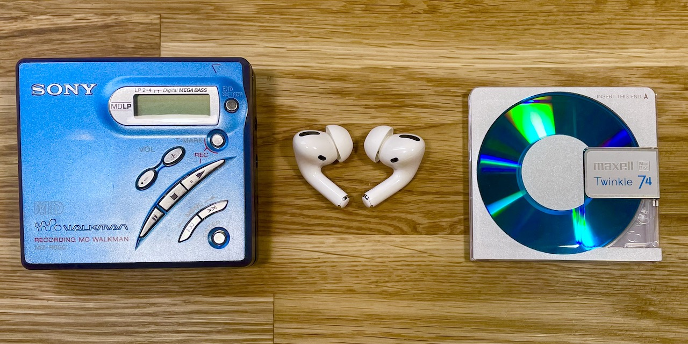
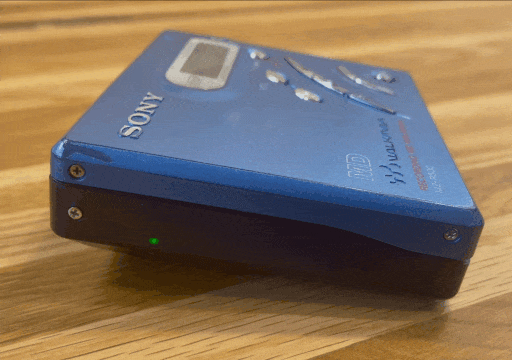
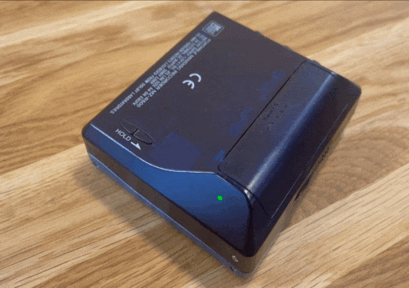

Home |
[Reverse engineering](re.md) |
[BTMD v0.1](v0.1.md) -
[v0.2](v0.2.md) -
[v0.3](v0.3.md) |
[References](refs.md)

# 💽 Bluetooth Minidisc

Bringing a Minidisc player from 2001 into 2021 by adding Bluetooth connectivity, without compromising looks and convenience.

- Follow the different iterations of the modding process:
  - [**v0.1**](v0.1.md) - the original idea and basic proof of concept
  - [**v0.2**](v0.2.md) - a significantly improved system
  - [**v0.3**](v0.3.md) - a little upgrade for an even better experience
- See v0.2 in action on [**YouTube**](https://www.youtube.com/@btmdberlin6980/videos). Enabling captions recommended. Better and newer videos coming soon.
- Read some scattered notes about the [**reverse engineering process**](re.md), figuring out how to make this work.
- Check some useful [**references**](refs.md).

 
