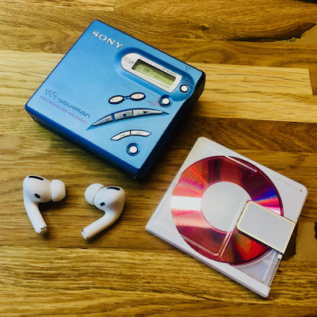

[Home](readme.md) |
[Reverse engineering](re.md) |
[BTMD v0.1](v0.1.md) -
[v0.2](v0.2.md) -
[v0.3](v0.3.md) |
References

## References

General information on Minidisc players, formats, and everything related:
- [minidisc.org](https://www.minidisc.org/)
  - [List of players and recorders](https://www.minidisc.org/equipment_browser.html)
  - [Page for MZ-R500](https://www.minidisc.org/part_Sony_MZ-R500.html)
- [MiniDisc Wiki](https://www.minidisc.wiki/)
  - [Page for MZ-R500](https://www.minidisc.wiki/equipment/sony/portable/mz-r500)

Both sites host excellent official User and *Service* Manuals for many of the listed devices. Among other things, the Service Manuals include:
- AWESOME Schematics
  - Thicker traces for power rails
  - Expected voltage levels on power rails
  - Full traces (no disjointed nets), straightforward jumps from page to page
  - Font unsuitable for A4 printing (6 looks like 8)
  - Only for main PCB. No schematic for button PCB (single layer)
- PCB layout (outer 2 layers only)
- System level block diagram
- Component level block diagram (main ICs)
- Pinouts (main ICs)
- full BOM

## Lessons learned, tips & tricks

- Unsure whether a specific BT transmitter will work? Buy multiple, don't be afraid to break one
- For easier prototyping: tap test pads, etc. with thin wire (e.g. 0.14mm²) and break out to breadboard-compatible connector. If necessary, solder the thin wire to a thicker gauge wire first (e.g. 0.25mm² stranded) for easier handling.
- Do not hook up stuff directly to each other. Use a breadboard inbetween for more flexibility, i.e. the ability to mix and match signals and measure inbetween
- Make tracing of vias easier by printing the board views from both sides at the same scale (as big as possible, e.g. A4), cut them out, and glue them together back to back. Hold against the light to see both layers at once.
- Take time to prepare properly to avoid errors/frustration later on

