[Home](readme.md) |
[Reverse engineering](re.md) |
[BTMD v0.1](v0.1.md) -
v0.2 -
[v0.3](v0.3.md) |
[References](refs.md)

## BTMD v0.2

A much improved version over [v0.1](v0.1.md): a more robust power supply, visible status LEDs, and improved audio quality thanks to isolation transformers.

### Requirements

- see [v0.1](v0.1.md)

### Materials

- Sony MZ-R500 Minidisc player ([minidisc.org](https://www.minidisc.org/part_Sony_MZ-R500.html), [MiniDisc wiki](https://www.minidisc.wiki/equipment/sony/portable/mz-r500))
- [Scosche FlyTunes](https://www.scosche.com/wireless-bluetooth-audio-transmitter) Bluetooth transmitter
- [Pololu U1V11F3](https://www.pololu.com/product/2561) 3.3V step-up voltage regulator module
- 2x ED8 audio transformer, 600:600, nickel steel (eBay, AliExpress, etc; original purchase links no longer working)
- 2x LED, 0805, green
- 2x resistor, 0805, 100Ω
- 2x resistor, 0805, 10kΩ
- 0.14mm² wire, multiple colors
- Kapton tape

### Preparation and disassembly

Open up the Bluetooth transmitter and the Minidisc unit, and perform the same steps as for [v0.1](v0.1.md):

- Remove the Bluetooth transmitter's battery, USB-C jack, tactile switch LEDs and audio wires.
- Cut the traces to the front PCB's `End Search` button and add some wires to the button.
- Remove the MD unit's magnetic write head and bracket

Remove the EMI shielding on the inside of the rear casing, as it is probably counterproductive to the Bluetooth functionality.

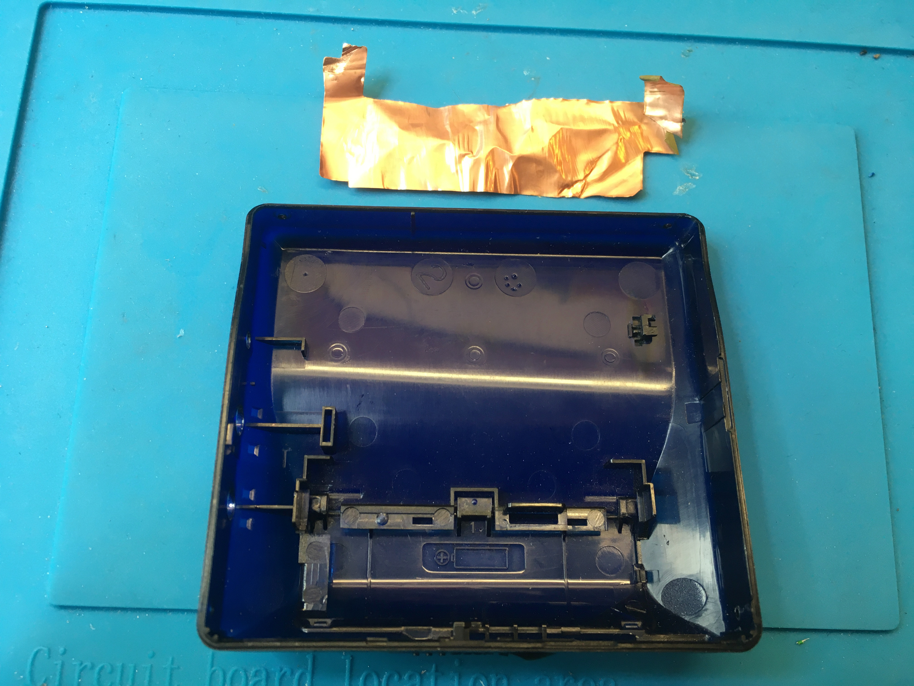

Detach the second ribbon cable on the main PCB, which goes to the spindle motor. Unscrew the main PCB. Carefully start separating the PCB from the MD drive assembly and detach the third ribbon cable, which goes to the optical unit. This is tricky since it sits *between* the PCB and drive assembly. Only now you can fully separate the two parts.

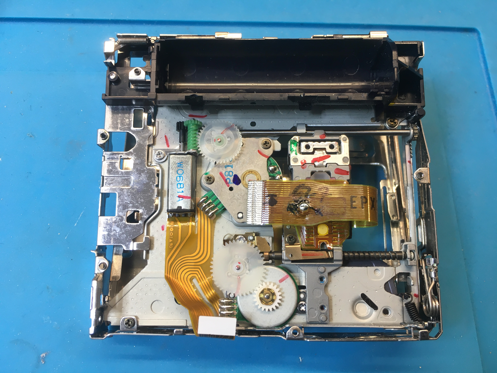

Remove the motor and worm gear that drive the mechanism that locks the casing during recording. Since recording functionality is removed anyway, this feature is no longer needed, and frees up valuable space inside the device. Desolder the motor from the flexible PCB, and cut off the motor's solder points.

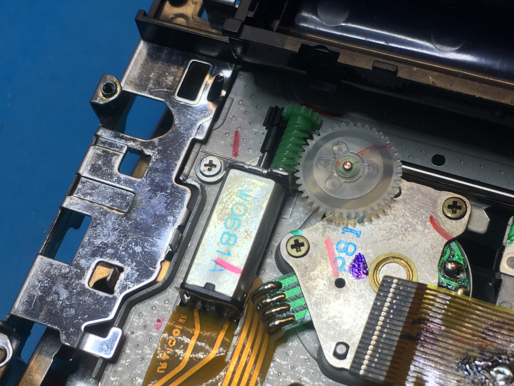
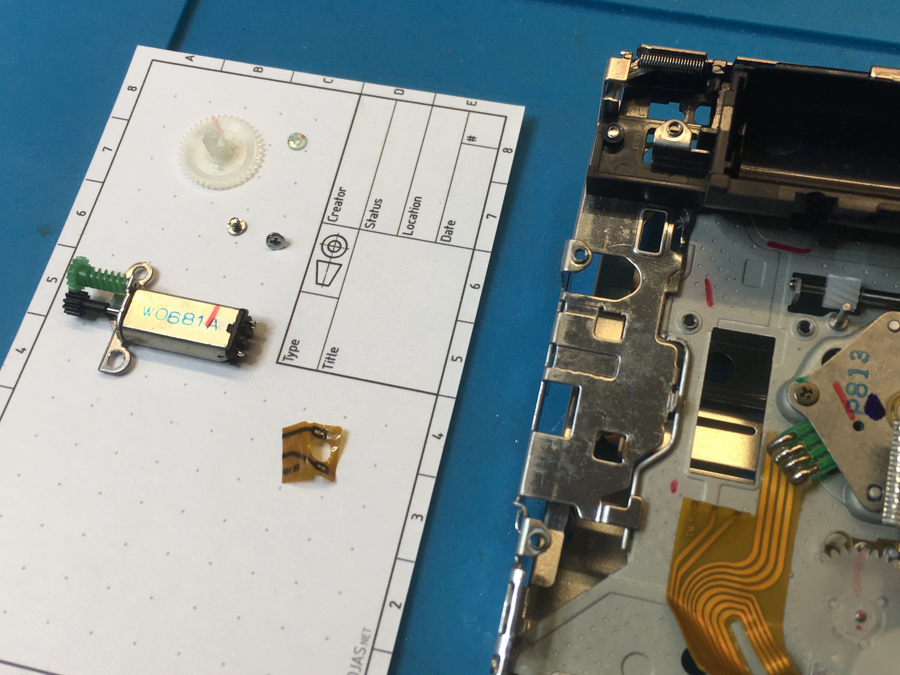

Remove the L-shaped flange (with the mounting thread) on the main chassis using a rotary tool. The corresponding mounting hole on the PCB will later be used to route some wires, so the mounting flange would only get in the way.

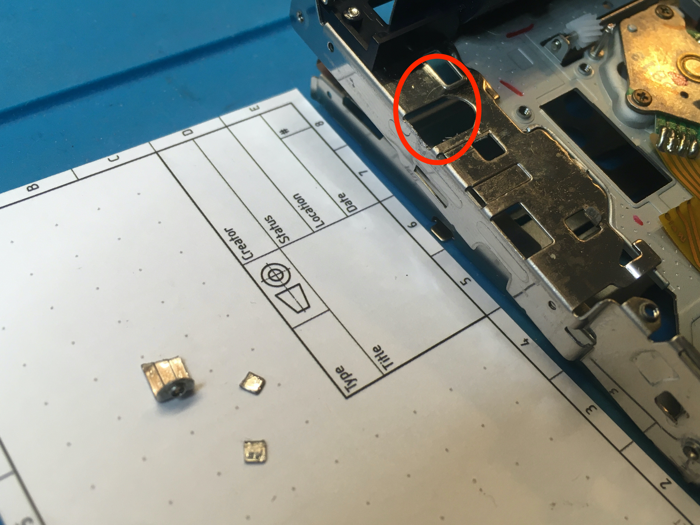

Use hot glue to fix the locking mechanism's gears in the open position. Since the drive motor is gone, this prevents the locking mechanism from accidentally slipping into the locked position, which would make opening up the device significantly more difficult.

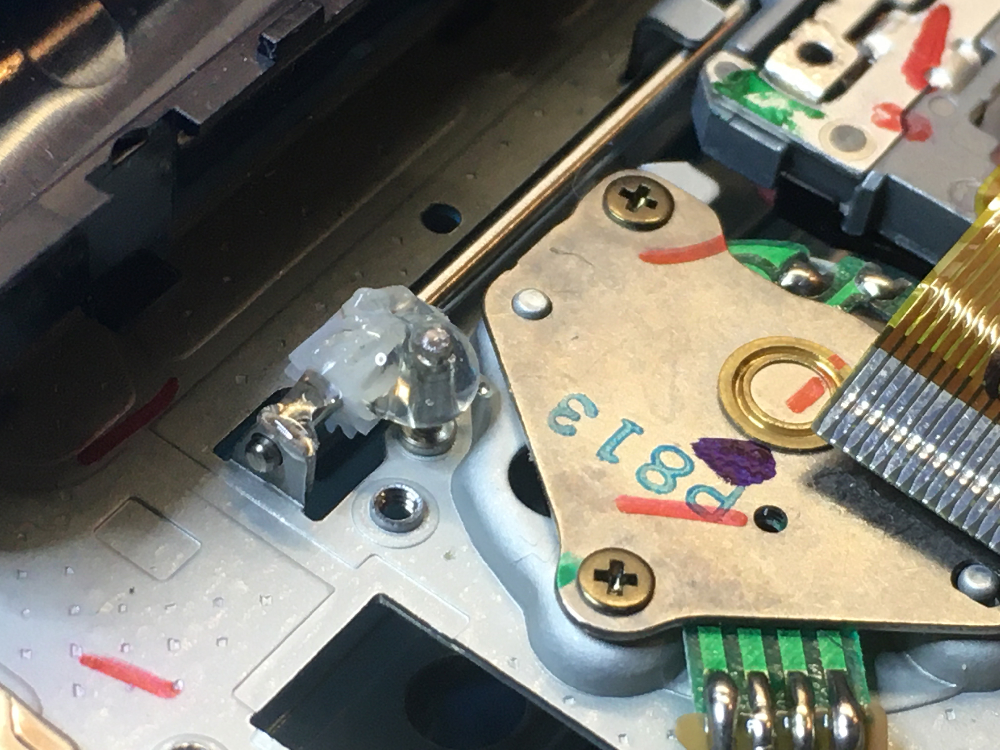

### Audio transformers

v0.1 suffered from interference from the Bluetooth module, resulting in audible beeping in the transmitted audio. The most likely source seems to be a fluctuation in the power lines caused by rapidly changing power draw of the transmitter module. No amount of decoupling and buffer capacitors helped; however, adding audio isolation transformers to the left and right audio channels, between the MD audio output and the Bluetooth module's audio input pins, successfully resolved the issue.

Desolder the white analog+optical input jack from the main PCB: Another component only required for the no longer usable recording function, and plenty of mm³ that can be put to better use.
The jack consists of two parts: The analog audio jack with through-hole pins for left, right, ground and plug detect; and a SMD photodiode for the optical input.
Insulate the solder points of the jack using Kapton tape.

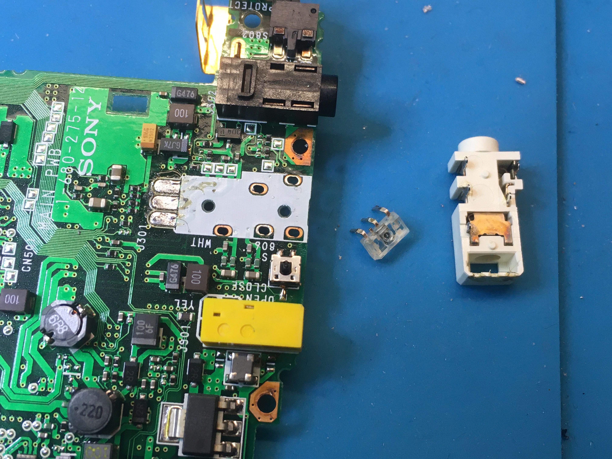
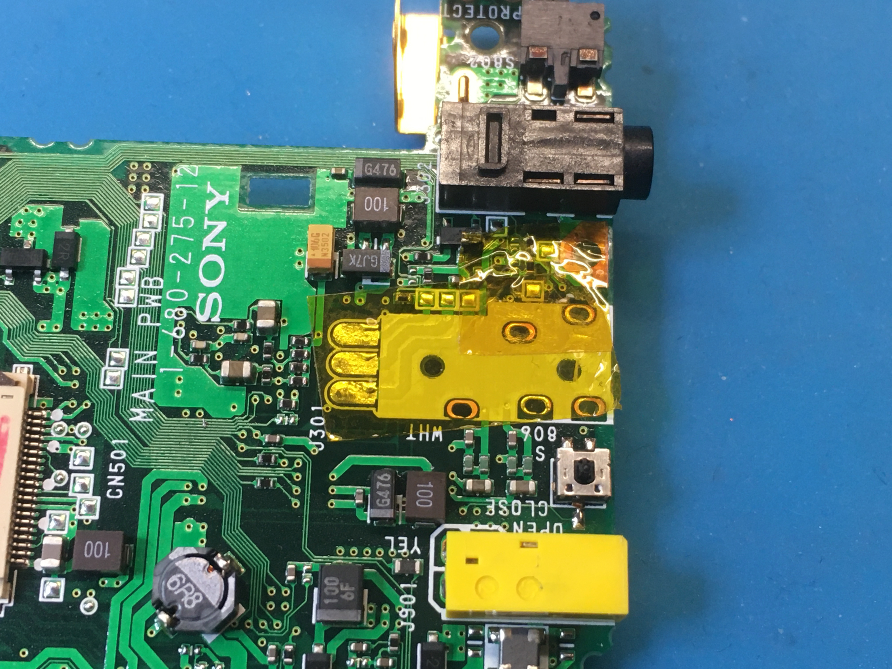

Mount the two audio transformers in the spot of the input jack. Hot glue works well. The transformers' legs should be pointing upwards for easier soldering. Label each transformer with `L` and `R` respectively for each audio channel, and add an arrow pointing from the input side (from the MD player) to the output (to the Bluetooth module).

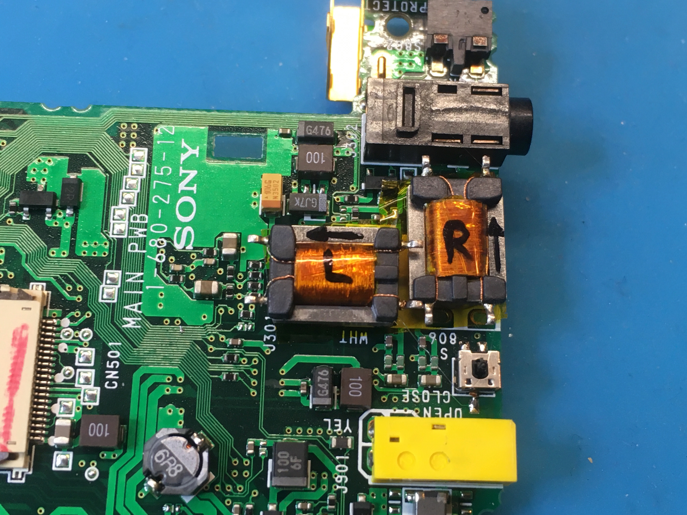

Insulate the gap between the right transformer's body and the left transformer's top right leg to avoid a short (see image below, next to the `R` label).
Wire the input side of the transformers to the MD unit's headphone out lines. Use the mounting hole next to the headphone jack to route the wires from one side of the PCB to the other.
Add wires to the output side of the transformers, that will go to the Bluetooth modules audio input pins. Use the square hole in the PCB to route these wires. Add a drop of hot glue as strain relief and cover everything in Kapton tape.

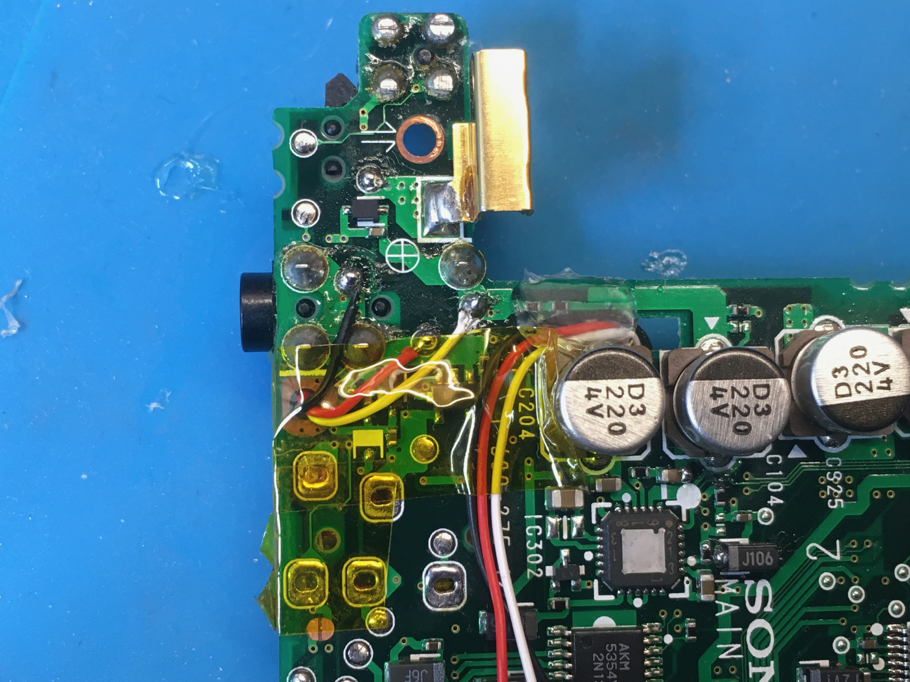

Mount the PCB onto the MD drive assembly and attach the two ribbon cables.

### Status LEDs

Prepare a small PCB with two LEDs, each with a 100Ω resistor in series. A snippet of regular perfboard PCB works well. These LEDs show the status of the Bluetooth module. Since they are mounted inside of the blue translucent casing of the MD player, green LEDs are recommended. Blue LEDs have higher voltage requirements, and red ones are not visible through the casing.

Add one wire to each LED's cathode, and one common wire to the resistors going to the anodes. In practice, it is not necessary to be able to distinguish one LED from the other, so mixing up the two cathode wires is not an issue.

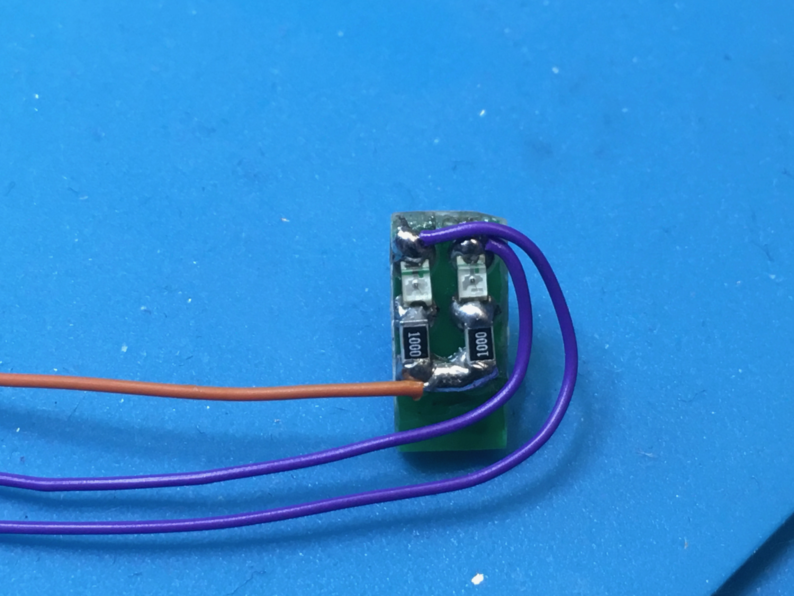

Using double-sided tape, attach the PCB to the outside of the battery compartment, so that the LEDs face outside.
(See image below)

### Wiring and integration

Solder two wires each to the main PCB's battery `+` and `-` terminals. Dual wires are used to reduce the overall resistance on these power-carrying lines.
Solder one wire to the leftmost of the four square test points between the battery compartment and the large capacitors.
This test point goes high while the MD unit is powered on, and is therefore the ideal candidate to control the shutdown line of the voltage regulator powering the Bluetooth module, which is necessary since the main power lines are hooked up directly to the battery.

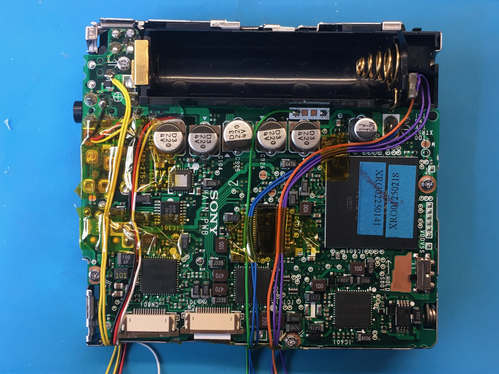

Mount the Bluetooth and voltage regulator modules inside the front casing using double-sided tape. Wire everything up as per the schematic. Route all wires neatly, and secure with Kapton tape.

The LEDs are wired directly to the castellated edges of the Bluetooth module's daughterboard `U1`. Since the pins are not labeled or numbered, pin numbers were assigned assuming pin 1 to be the top left pin (next to the `U1` label) and going counterclockwise.

|            |         | wire color  | on MD unit       | on voltage regulator      | on BT module                        |
|------------|---------|-------------|------------------|---------------------------|-------------------------------------|
| **Power**  | `1V5`   | yellow (2x) | `TP914` `(+)`    | `VIN`                     |                                     |
|            | `3V3`   | orange (2x) |                  | `VOUT`                    | `BAT+`                              |
|            | `GND`   | blue (2x)   | `TP915` `(-)`    | `GND`                     | `BAT-`                              |
|            | `/SHDN` | green       | `AP302`          | `/SHDN` via 10kΩ resistor |                                     |
| **Audio**  | `L`     | white       | `TP101`          |                           | `L_IN` via transformer              |
|            | `R`     | red         | `TP201`          |                           | `R_IN` via transformer              |
|            | `GND`   | black       | `TP319`          |                           | `GND`  via transformer              |
| **LEDs**   | `LED1`  | violet      |                  |                           | `U1` `pin 35` (?) via 100Ω resistor |
|            | `LED2`  | violet      |                  |                           | `U1` `pin 36` (?) via 100Ω resistor |
|            | `COM`   | orange      |                  | `VOUT`                    |                                     |
| **Button** | `1`     | blue        | `End Search (1)` |                           | `BAT+` via 10kΩ  resistor           |
|            | `2`     | blue        | `End Search (2)` |                           | `U1` `pin 28` (?)                              |

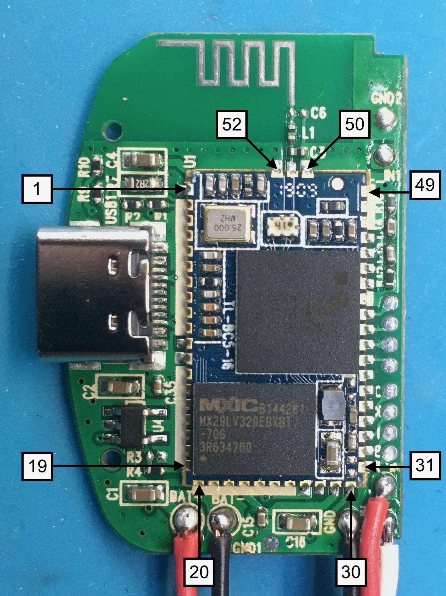
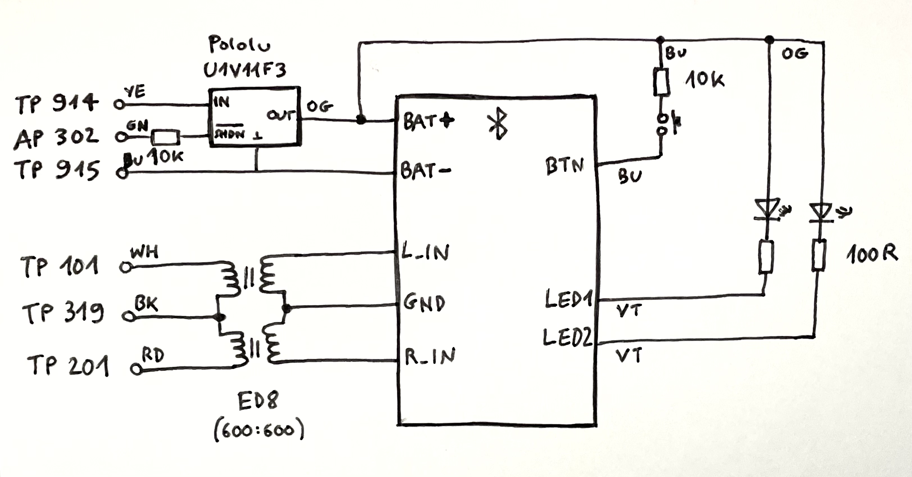
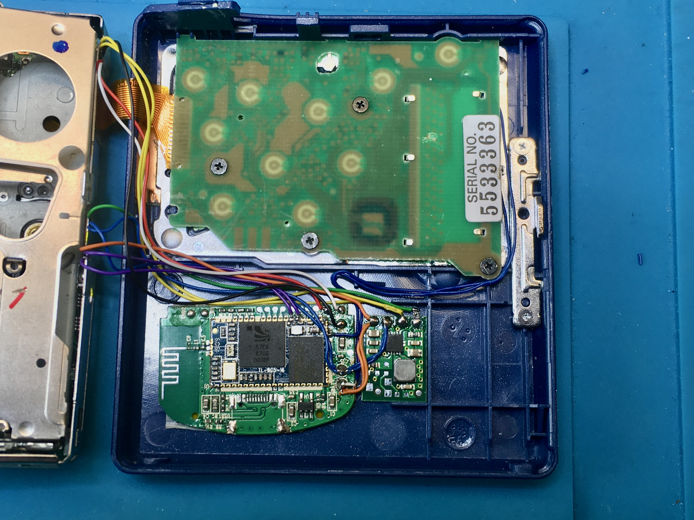
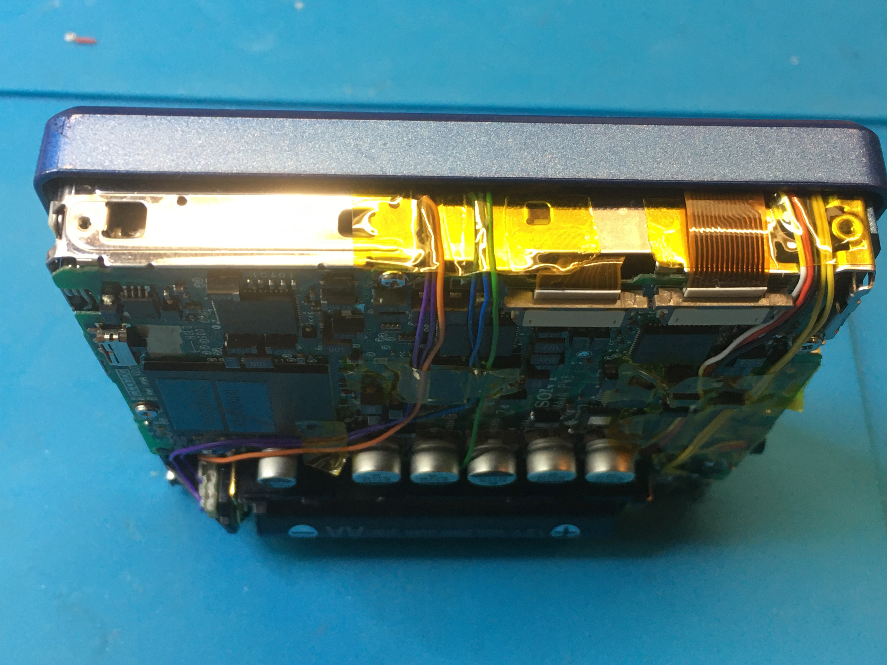

Close everything back up! Enjoy!

Or consider the upgrade to [v0.3](v0.3.md) to have Bluetooth auto-power-up for a more seamless experience.
