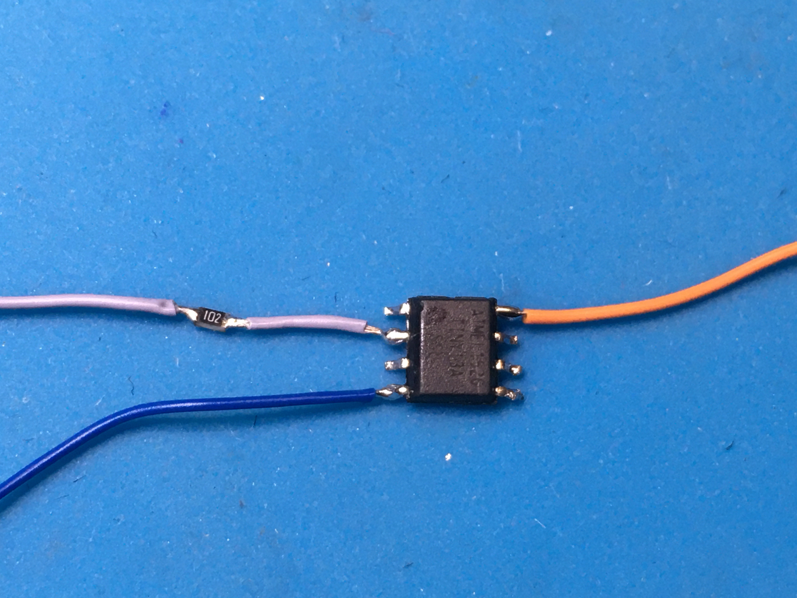
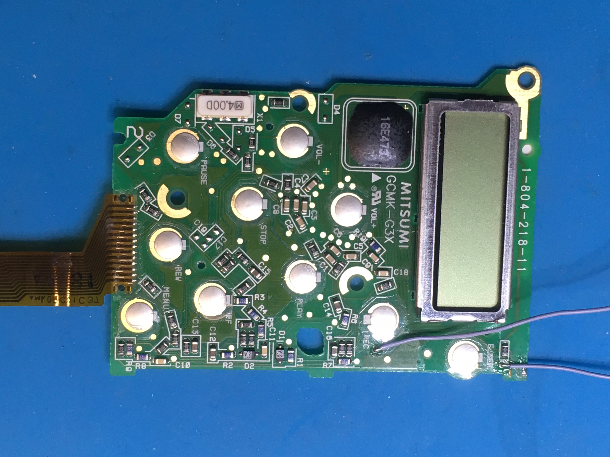
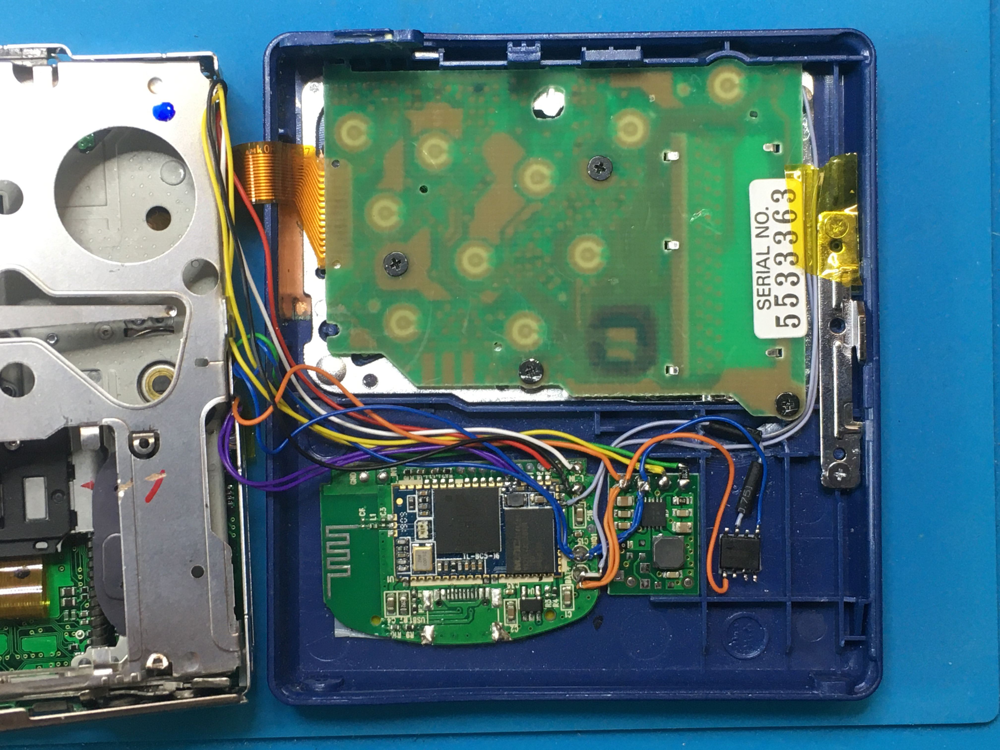

## BTMD v0.3

An incremental improvement over [v0.2](v0.2.md): adding a small microcontroller circuit to have the Bluetooth module automatically start up once the MD player is turned on, greatly improving the user experience.

### Requirements

- see [v0.1](v0.1.md)

### Materials

- Sony MZ-R500 Minidisc player ([minidisc.org](https://www.minidisc.org/part_Sony_MZ-R500.html), [MiniDisc wiki](https://www.minidisc.wiki/equipment/sony/portable/mz-r500))
- successful conversion of the player to [BTMD v0.2](v0.2.md)
- ATtiny13A microcontroller
- 0.14mm² wire, multiple colors
- Resistor, 0805, 1kΩ
- heatshrink tubing

### Integration

Flash the microcontroller with the provided [firmware](../firmware/main.hex). The firmware is extremely simple: Upon power up, the microcontroller sets one of its output pins to `HIGH` for 3.2 seconds. This is long enough to trigger the Bluetooth module to turn on, but short enough not to trigger pairing mode. Afterwards, the pin is set `LOW`, and the microcontroller goes into sleep mode indefinitely. This functionality could surely also have been implemented using a small comparator circuit; however, the ATtiny was immediately available at the time, and requires zero supporting circuitry to work, and not even a PCB to sit on!

Attach wires to the microcontroller's leads as per the schematic, with an inline 1kΩ resistor on the output pin `PB3` (pin 2).

Wire the microcontroller as per the schematic. Connect the microcontroller's output pin to the Bluetooth module's button pin, in parallel to the wire coming from the front PCB's `End Search` button. This way, the button can still be used to pair new devices, or force the Bluetooth module to turn on and off if needed.

Fix the microcontroller in place with double-sided tape. Cut out gaps in the front casing's ribs to route the wires.

Your BTMD player now has auto-connect on power up functionality! :tada:
