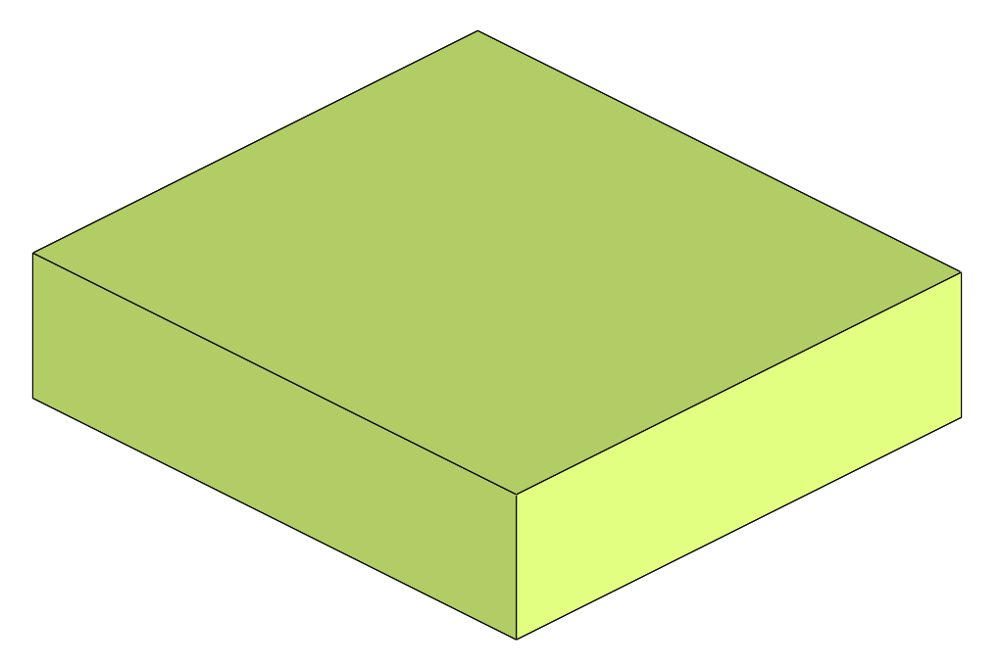
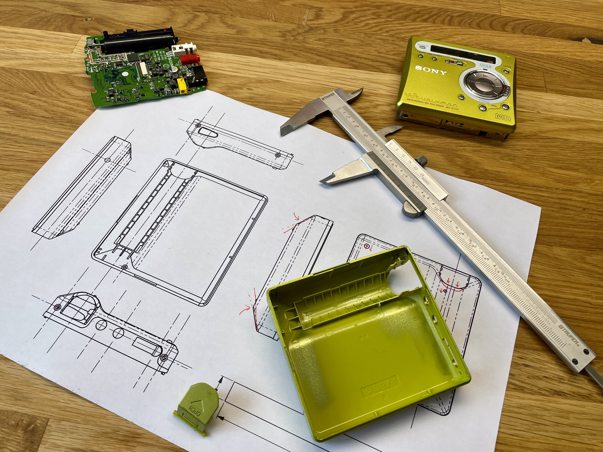

[Home](readme.md) |
[Reverse engineering](re.md) |
[BTMD v0.1](v0.1.md) -
[v0.2](v0.2.md) -
[v0.3](v0.3.md) -
v0.4 |
[References](refs.md)

## :construction: BTMD v0.4 :construction:

A new version of the BTMD project is currently in the works.
The goal is to design a custom rear shell to house the additional hardware, without the need for removing the recording mechanism, and hopefully with a better placement of the Bluetooth antenna for better range and signal stability. The mod will likely be performed on a [MZ-R700](https://www.minidisc.wiki/equipment/sony/portable/mz-r700) MD Walkman.

Support BTMD development [here](https://ko-fi.com/M4M3I2NCA). Thanks! :smiley_cat:

